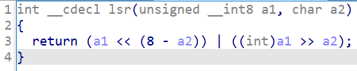

# PEVO

### Info

**Category**: Crypto

**Difficulty**: Easy

**Description**: Cybersecurity student encrypted his beer voucher with "Private Encription Virtual Operator" and forgot the key. Now he has to do his research and he is in a desparate need of beer, the sooner, the better. Will you be so kind to help him recover his beer voucher?

**Files**: `PEVO.exe`, `output.txt`

**Flag**: `ctf{T3rM0r3Ct4L_cR1pT4nAl1Si5}`

### Solution:

У нас есть бинарь и файл, являющийся результатом его работы (30 байт). Рассмотрим, что представляет из себя бинарь:

На вход принимается название файла и ключ от пользователя длиной 32 байта, а затем файл посимвольно шифруется в цикле со счётчиком `j`. Используется 3 операции:

1. Отображение из байта в байт с помощью массива `matrix`:

2. XOR полученного байта c байтом ключа по позиции `j % 5`. Получается, программа использует лишь первые 5 символов ключа.
3. Битовый сдвиг вправо на 'j % 5' символов в функции `lsr`:

Для дешифрования имеющегося файла пишем скрипт, который воспроизводит алгоритм шифрования в обратном порядке (`decoder.py`). Важны лишь первые 5 сиволов ключа, из них первые 4 можно подобрать, т.к. формат флага известен (`ctf{[\!-z]+}`). Получается `IsCr`. Для получения 5-го символа есть два возможных варианта действий:

1. В шифртексте 30 символов (кратно 5-ти), а также известно, что флаг заканчивается на `}` (30-я позиция), тогда символ ключа можно подобрать по соответствию между исходным байтом и зашифрованным;
2. Подобрать 5-ый символ перебором, что вполне возможно, т.к. задание выдавалось на ISCRA Talks 2025 ^_^

После получения ключа `IsCrA` остаётся только восстановить флаг из шифртекста. Теперь пиво ваше!
